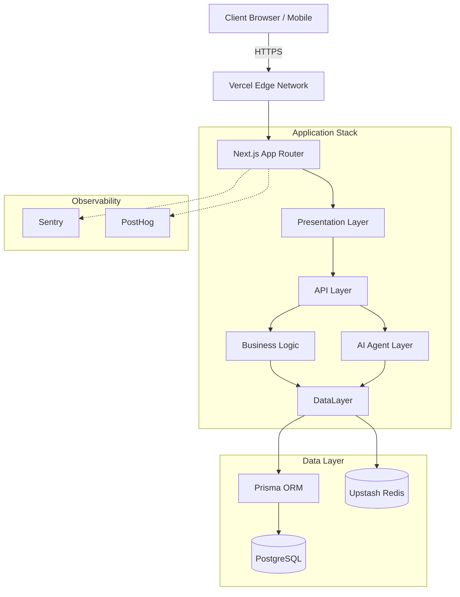
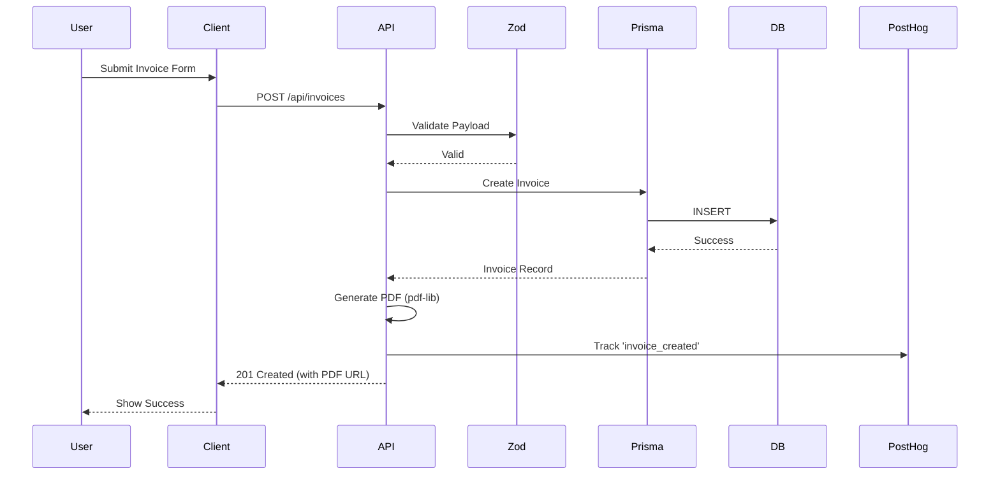
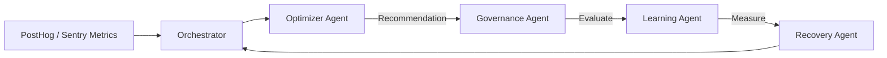
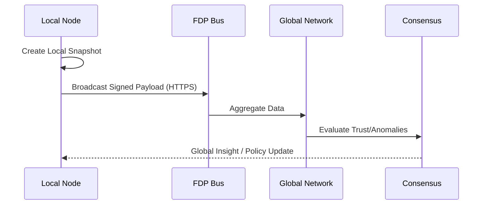
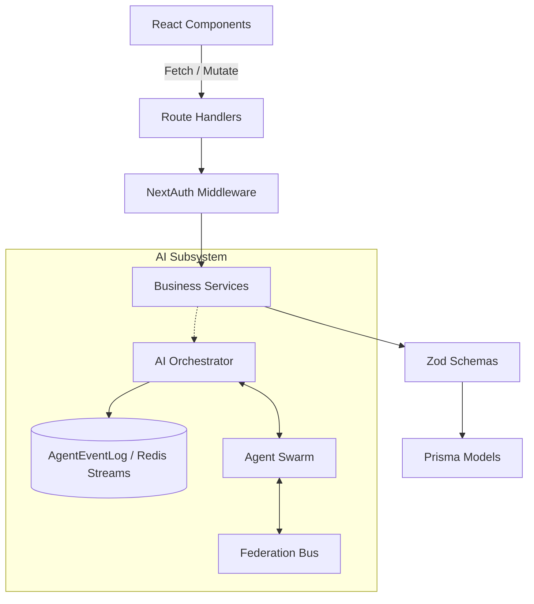

# InvoSmart System Architecture

This document provides a comprehensive overview of the system architecture for InvoSmart, a next-generation invoice and receipt management system powered by an autonomous multi-agent AI system.

## 1. High-Level Architecture Overview

InvoSmart is built on a modern, scalable stack using Next.js 15 (App Router) with a multi-layered architecture. It integrates a powerful AI agent system, a robust data layer, and comprehensive observability.



## 2. Layer-by-Layer Breakdown

### Presentation Layer
- **Tech Stack**: Next.js 15 App Router, React 18, Tailwind CSS v4, Framer Motion, Recharts, ReactFlow.
- **Design**: Modern glassmorphism design language with fluid animations.
- **Responsibility**: Rendering UI, client-side routing, optimistic UI updates, and data visualization.

### API Layer
- **Tech Stack**: Next.js Route Handlers (`/api/*`), NextAuth.js.
- **Responsibility**: Exposing RESTful endpoints, authenticating requests, enforcing rate limits, parsing and validating incoming data via Zod, and ensuring HTTPS enforcement.

### Business Logic Layer
- **Components**: Invoice CRUD, receipt management, PDF generation (via `pdf-lib`), AI invoice composer.
- **Responsibility**: Core application logic linking the presentation layer to the data and AI layers.

### AI Agent Layer
- **Components**: 6 Specialized Agents (Optimizer, Learning, Governance, Recovery, Insight, Federation) coordinated by the MAP protocol via an Orchestrator.
- **Responsibility**: Autonomous system optimization, anomaly detection, predictive scaling, and cross-tenant trust sharing.

### Data Layer
- **Tech Stack**: Prisma ORM, PostgreSQL (Unified Dev & Production Database), Upstash Redis (see `docs/DATABASE.md` for database migration workflows and setup details).
- **Responsibility**: Persistent storage, caching, real-time event streaming, and providing in-memory fallbacks when primary data stores are unavailable.

### Observability Layer
- **Tech Stack**: Sentry (Client & Server), PostHog, web-vitals.
- **Responsibility**: Distributed tracing, Real User Monitoring (RUM), error tracking, and AI system telemetry.

## 3. Data Flow Diagrams

### Invoice Creation Flow


### AI Optimization Loop


### Federation Flow


## 4. Component Interaction



## 5. Technology Decision Table

| Category | Technology | Primary Purpose | Justification |
| :--- | :--- | :--- | :--- |
| **Framework** | Next.js 15 | App rendering, routing | App Router provides excellent server/client component boundaries. |
| **Language** | TypeScript 5.9 | Type safety | Strict typing reduces runtime errors, especially with complex AI state. |
| **Styling** | Tailwind CSS v4 | UI styling | Rapid styling with glassmorphism support. |
| **Database** | PostgreSQL | Primary Data Store | Relational integrity for financial documents via Prisma. |
| **Cache & Bus** | Upstash Redis | Cache & Event Streams | Ideal for serverless environments and the AI Orchestrator event bus. |
| **Auth** | NextAuth.js | Authentication | Seamless Next.js integration. |
| **Validation** | Zod | Schema definition | End-to-end type safety from API to DB. |
| **Analytics** | PostHog & Sentry | Observability | PostHog for RUM/events, Sentry for error tracing. |
| **PDF** | pdf-lib | Document Generation | Reliable client/server-side PDF manipulation. |

## 6. Directory Structure Map

```
/
├── app/                  # Next.js App Router (Presentation & API Layer)
│   ├── (auth)/           # /auth/login, /auth/register
│   ├── (dashboard)/      # /app/dashboard, /app/settings/*, /app/admin/*
│   ├── invoices/         # /app/invoices/new, /app/invoices/[id]
│   ├── receipts/         # /app/receipts, /app/receipts/scan, /receipts/[id]/verify
│   ├── devtools/         # /devtools/*
│   └── api/              # Route handlers
├── components/           # React Components (UI, Forms, Charts)
├── lib/                  # Core Business Logic
│   ├── ai/               # AI Agent Architecture
│   │   ├── orchestrator.ts # Central event bus
│   │   ├── protocol.ts   # Zod-validated MAP events
│   │   ├── loop.ts       # Autonomous scaling loop
│   │   └── scaler.ts     # Adaptive concurrency
│   ├── federation/       # FDP signed HTTPS bus
│   └── ...
├── prisma/               # Prisma schema and migrations
└── public/               # Static assets
```

## 7. Security Model

- **Authentication & Authorization**: Protected routes under `/app/*` enforced by NextAuth middleware. Passwords hashed using bcrypt.
- **Headers & Transport**: 
  - HTTPS enforcement in production.
  - Strict security headers: `X-Frame-Options: DENY`, `X-Content-Type-Options: nosniff`, and strict `Referrer-Policy`.
- **API Security**:
  - Global rate limiting: 10 requests per minute per IP per bucket.
  - Strict input validation using Zod on all API endpoints.

## 8. Caching Strategy

- **Two-Tier System**: Upstash Redis acts as the primary distributed cache, falling back to an in-memory Map when unavailable.
- **Dynamic Content**: Items like theme suggestions have a targeted 1-hour TTL.
- **Static Assets**: Edge cached with `Cache-Control: max-age=31536000, immutable`.

## 9. AI Agent Architecture Details

- **Orchestrator (`lib/ai/orchestrator.ts`)**: Acts as the central nervous system, managing the Redis Streams and Prisma `AgentEventLog`.
- **Protocol (`lib/ai/protocol.ts`)**: Standardizes inter-agent communication using Zod validation. Event types include `recommendation`, `evaluation`, `policy_update`, `insight_report`, and `recovery_action`.
- **Autonomous Loop (`lib/ai/loop.ts`)**: Executes a continuous lifecycle: Telemetry Analysis → Prioritization → Scaling → Recovery → Dispatch.
- **Federation (`lib/federation/`)**: Enables secure, cross-tenant insights using an FDP signed HTTPS bus.
- **Scaler (`lib/ai/scaler.ts`)**: Adapts system performance based on pressure, adjusting concurrency between 1 and 6 agents and modifying intervals from 1 minute to 15 minutes.

## 10. Deployment Architecture

- **Platform**: Vercel
- **CI/CD**: GitHub Actions workflows for automated testing, linting, and deployment.
- **Development**: Local server running with PostgreSQL database managed via Prisma versioned migrations (`npx prisma migrate dev`).
- **Production**: Distributed Vercel Edge functions, Upstash Redis, and managed PostgreSQL with automated migrations (`npx prisma migrate deploy`).
