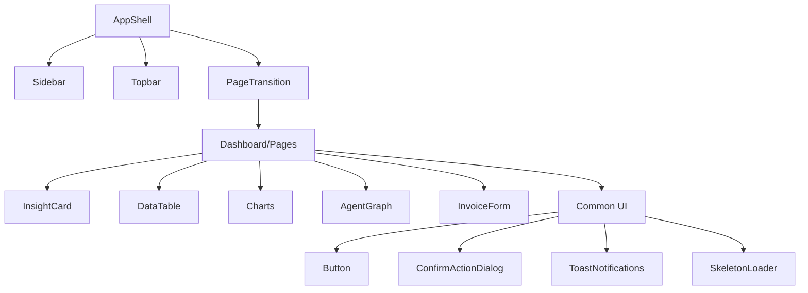

# InvoSmart UI/UX Design Specification

## Design Philosophy

InvoSmart uses a premium, dark-first glassmorphism design system inspired by editorial and high-end SaaS aesthetics. The overarching product metaphor is "InvoSmart OS 02", suggesting a refined, intelligent, and highly capable operating system for invoicing and financial management.

## Color System

The color system relies on CSS variables for a seamless dark-to-light theme transition. The primary mode is dark.

### CSS Variables

```css
:root {
  --color-primary: 99 102 241;  /* Indigo-500 */
  --color-accent: 34 211 238;   /* Cyan-400 */
  --color-bg: 14 16 22;         /* Near-black */
  --color-text: 243 244 246;    /* Gray-100 */
  --surface-base: 24 27 34;
  --surface-elevated: 31 35 45;
  --surface-border: 255 255 255;
}

[data-theme="light"] {
  --color-bg: 255 255 255;
  --color-text: 15 23 42;
  --surface-base: 255 255 255;
  --surface-elevated: 241 245 249;
  --surface-border: 148 163 184;
}
```

### Color Palette Description
- **Primary (Indigo-500):** Used for primary actions, active states, and emphasis.
- **Accent (Cyan-400):** Used sparingly for highlights, gradients, and secondary visual interest.
- **Background:** A deep near-black in dark mode for maximum contrast and depth; clean white in light mode.
- **Surfaces:** Layered elevations with subtle background shifts and borders to create depth without heavy drop shadows.

## Typography

- **Primary Font:** Plus Jakarta Sans (loaded as `--font-geist-sans`)
- **Monospace Font:** Geist Mono
- **Headings:** `font-weight: 700`
- **Body Text:** `font-weight: 400`, `line-height: 1.4`
- **Global Letter Spacing:** `-0.015em` (for a tighter, more modern look)
- **Label Style:** Uppercase with extreme tracking (`tracking-[0.32em]`) for small, editorial-style labels.

## Surface Styles

InvoSmart relies heavily on layered glass and gradient effects to create a premium feel.

- **`.glass-surface`:** `rgba` background (0.8 opacity), 1px border (0.12 opacity), `backdrop-filter: blur(18px)`, box-shadow.
- **`.gradient-button`:** Linear gradient 135deg primary → accent, glowing box-shadow.
- **`.gradient-border`:** Pseudo-element gradient border with 20px radius.
- **`.glow-border`:** 2px gradient padding with 48px blur glow effect.
- **`.bg-diagonal-grid`:** Subtle diagonal grid pattern overlay to add texture to empty spaces or large backgrounds.

## Layout Patterns

- **Landing Page:** Full-width sections utilizing an editorial grid, metric badges, and testimonials.
- **App Pages:** Persistent sidebar navigation with a main content area.
- **Settings:** Tabbed interface for organizing preferences.
- **Admin:** Dashboard grid layout optimized for data density.
- **DevTools:** Specialized monitoring UIs for technical users.

## Component Inventory

### Component Hierarchy



### Core Components

1. **AppShell:** Master layout wrapper handling Sidebar, Topbar, and PageTransitions.
2. **Sidebar:** Glass surface navigation. Features icon-based links with tooltips and a role indicator.
3. **Topbar:** Contains global search, theme toggle, and user profile menu.
4. **Button:** Interactive element with async loading states (spinner transitioning to a checkmark). Features a gradient variant and a scale-down tap effect (`whileTap: { scale: 0.95 }` via Framer Motion).
5. **InsightCard:** Key metric display incorporating an icon, value, and label.
6. **ConfirmActionDialog:** Accessible modal (`role="alertdialog"`) with a backdrop blur overlay.
7. **Toast Notifications:** Auto-dismissing alerts with animated entry and exit via Framer Motion.
8. **Skeleton Loader:** Loading state placeholder with a 2.4s shimmer animation cycle.
9. **InvoiceForm:** Complex form with dynamic item lists, real-time calculations, and Zod validation providing accessible error messaging.
10. **AuthCard:** Centered glass-styled card for login and registration flows.
11. **DataTable:** List view for invoices featuring status badges and sortable columns.
12. **Charts:** Recharts integration for revenue and analytics visualization.
13. **Agent Graph:** ReactFlow integration for visualizing AI agent relationships and workflows.

## Interaction Patterns

- **Predictive Prefetching:** AI confidence scores trigger data prefetching during browser idle (`requestIdleCallback`) to ensure instant load times.
- **Page Transitions:** Smooth transitions managed by Framer Motion to maintain spatial context between views.
- **Tooltips:** Pure CSS implementations utilizing blur transitions on hover and focus.
- **Theme Switching:** Managed via the `data-theme` attribute, instantly synced to both `localStorage` and the backend API.

## Responsive Design

- **Mobile-First Approach:** Base styles target mobile, with the sidebar collapsing into a hamburger menu or bottom bar on smaller screens.
- **Fluid Layouts:** Fluid typography and spacing scales adapt gracefully across breakpoints.
- **Touch Optimization:** Tap targets are generously sized (minimum 44x44px) for touch interfaces.

## Accessibility (a11y)

InvoSmart is committed to inclusive design.

- **Forms:** Heavy use of `aria-invalid` and `aria-describedby` to link inputs with validation error messages.
- **Dialogs:** Destructive or critical confirmations use `role="alertdialog"` to properly announce themselves to screen readers.
- **Keyboard Navigation:** Full support for keyboard focus management and navigation.
- **Contrast:** Strict color contrast management between dark and light themes to meet WCAG AA standards.
