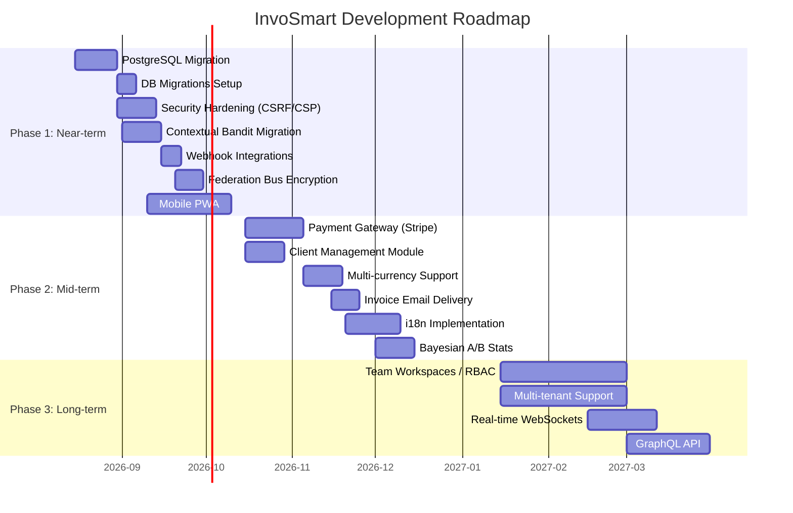

# InvoSmart Roadmap & TODOs

**Current Version:** v1.1.0 (August 2026)

This document outlines the strategic roadmap and upcoming features for InvoSmart. It is divided into three main phases: Near-term, Mid-term, and Long-term.

---

## Completed Features (v1.0.1)

- ✅ Full invoice CRUD with auto-numbering
- ✅ AI Invoice Composer (GPT-4o-mini/Gemini)
- ✅ PDF export with custom branding (pdf-lib)
- ✅ Receipt management with AI scanning
- ✅ Dashboard with revenue analytics
- ✅ NextAuth authentication (credentials + Google OAuth)
- ✅ Dark/light theme with glassmorphism UI
- ✅ AI Optimizer Agent with PostHog/Sentry metrics
- ✅ AI Learning Agent with composite impact evaluation
- ✅ AI Governance Agent with trust scoring and policy enforcement
- ✅ AI Insight Agent with cross-metric correlation
- ✅ AI Recovery Agent with auto-rollback
- ✅ AI Federation Agent with FDP protocol
- ✅ MAP Protocol with Redis Streams orchestration
- ✅ Autonomous loop with adaptive scaling
- ✅ Content A/B testing engine (local + global optimizer)
- ✅ Semi-autonomous auto-publish with approval gates
- ✅ Admin panel (experiments, auto-actions, manual revert)
- ✅ 7 DevTools pages (agents, audit, autonomy, federation, learning, tuning, perf)
- ✅ Sentry + PostHog observability stack
- ✅ Core Web Vitals (RUM) monitoring
- ✅ CI/CD pipeline (GitHub Actions → Semantic Release → Vercel)
- ✅ Vitest unit tests + Playwright E2E
- ✅ Rate limiting and security headers
- ✅ Two-tier caching (Redis + in-memory)

### Phase 1 Additions (v1.1.0)
- ✅ Contextual bandit model (LinUCB) in content optimizer
- ✅ Discord/Slack real-time webhook alerts for AI auto-actions
- ✅ Federation bus RSA-2048/AES-256-GCM asymmetric encryption
- ✅ PostgreSQL migration workflow (`prisma migrate dev`)
- ✅ CSRF protection (Double Submit Cookie) + Content-Security-Policy
- ✅ Comprehensive audit logging (invoices, auth, AI actions) with admin UI
- ✅ 312 Vitest tests (↑30 from v1.0.1)

---

## Project Timeline Overview

---

## Phase 1: Near-term (Infrastructure & Core Upgrades)

*Focus on addressing technical debt, improving security, and upgrading AI infrastructure.*

| Task | Category | Priority | Effort | Status |
| :--- | :------- | :------- | :----- | :----- |
| Migrate database provider from SQLite dev to consistent PostgreSQL | Infra | P0 | M | ✅ Done |
| Add database migrations (replace `db push`) | Infra | P0 | M | ✅ Done |
| Implement CSRF protection and strict Content-Security-Policy | Security | P0 | M | ✅ Done |
| Migrate from template-based bandit to contextual bandit model in `content-local-optimizer.ts` | AI | P1 | M | ✅ Done |
| Implement asymmetric encryption for Federation bus payloads (`lib/federation/bus.ts`) | Security | P1 | M | ✅ Done |
| Discord/Slack webhook integration for `ai_auto_actions` real-time alerts | Integrations | P1 | S | ✅ Done |
| Implement comprehensive audit logging for all user actions | Security | P1 | S | ✅ Done |
| Mobile responsive app enhancements / PWA setup | UX/UI | P1 | L | 📅 Planned |
| Increase E2E test coverage for all critical user flows | Testing | P2 | L | 📅 Planned |

---

## Phase 2: Mid-term (Features & Ecosystem Expansion)

*Focus on user-facing features, integrations, and business value.*

| Task | Category | Priority | Effort | Status |
| :--- | :------- | :------- | :----- | :----- |
| Payment gateway integration (Stripe/Midtrans) | Features | P1 | L | 📅 Planned |
| Multi-currency support | Features | P1 | M | 📅 Planned |
| Add client/customer management module | Features | P1 | M | 📅 Planned |
| Implement invoice email delivery | Features | P1 | M | 📅 Planned |
| Slack/WhatsApp integrations for notifications | Integrations | P2 | M | 📅 Planned |
| Implement recurring invoice templates | Features | P2 | S | 📅 Planned |
| Add proper i18n framework (replace hardcoded locales) | UX/UI | P2 | M | 📅 Planned |
| Add export/import functionality (CSV, Excel) | Features | P2 | S | 📅 Planned |
| Implement ISR/SSG for static pages | Performance | P2 | M | 📅 Planned |
| Add A/B test statistical significance calculator (Bayesian methods) | AI | P2 | M | 📅 Planned |
| Implement feature flags system | Infra | P2 | M | 📅 Planned |
| Add uptime monitoring and alerting | Ops | P2 | S | 📅 Planned |

---

## Phase 3: Long-term (Enterprise Scale & Advanced AI)

*Focus on enterprise capabilities, architectural evolution, and advanced machine learning.*

| Task | Category | Priority | Effort | Status |
| :--- | :------- | :------- | :----- | :----- |
| Team workspaces with role-based access control (RBAC) | Enterprise | P2 | XL | 📅 Planned |
| Add multi-tenant organization support | Enterprise | P2 | XL | 📅 Planned |
| Implement real-time notifications/WebSocket for invoice status changes | UX/UI | P2 | L | 📅 Planned |
| Comprehensive API documentation (OpenAPI/Swagger) | API | P2 | M | 📅 Planned |
| AI: Implement full contextual bandit incorporating diverse user features | AI | P2 | L | 📅 Planned |
| Add API versioning | API | P3 | S | 📅 Planned |
| Implement GraphQL API layer | API | P3 | L | 📅 Planned |

---

## Effort Estimates Legend

* **S (Small):** < 3 Days
* **M (Medium):** 1-2 Weeks
* **L (Large):** 2-4 Weeks
* **XL (Extra Large):** 1+ Months

## Priority Levels

* **P0:** Critical for stability, security, or core operation.
* **P1:** High business value or critical feature parity.
* **P2:** Important enhancement, improves user experience.
* **P3:** Nice to have, quality of life improvement.
