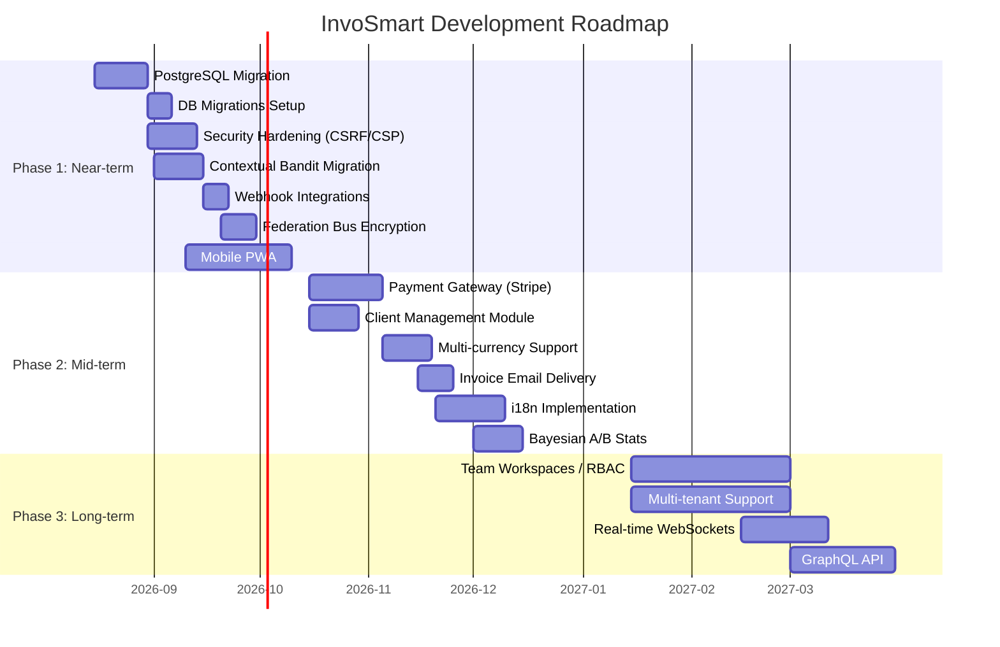

# InvoSmart Roadmap & TODOs

**Current Version:** v1.2.1-dev (August 2026)

This document outlines the strategic roadmap and upcoming features for InvoSmart. It is divided into three main phases: Near-term, Mid-term, and Long-term.

## Current Execution Update (2026-08-13)

The latest execution pass is focused on release readiness around the Phase 2 foundation. Statuses distinguish an available implementation from provider/device validation that is still outstanding: `✅ Done` means the feature implementation is present, while `🚧 Hardening` means the implementation exists but its production validation is not complete.

- **Release-gate stabilization — 🚧 In Progress:** flat ESLint ignores now replace the removed `.eslintignore`, production-source lint errors are fixed, `npm run typecheck` is a CI gate, and the Playwright suite is restricted to browser specs. The local Node 20-compatible verification pass now has lint, TypeScript, Vitest, and `next build` passing; CI Node 20, provider sandboxes, and browser/device evidence remain required.
- **Currency hardening — 🚧 In Progress:** `formatCurrency()` now normalizes currency codes, defaults to IDR, preserves nominal invoice units, and applies zero-decimal rules for IDR/JPY with targeted unit coverage. Payment-attempt amount/currency reconciliation is now enforced at both gateway webhook boundaries; live sandbox certification remains.
- **PWA/mobile hardening — 🚧 In Progress:** service-worker cache versioning and cleanup are in place, API/navigation/cross-origin requests are excluded from caching, and light/dark viewport metadata is explicit. Device and critical-flow E2E validation remain.
- **Client module cleanup — ✅ Done:** client list/detail contracts use stable `invoiceCount`/`revenue` and `totalRevenue`/`unpaidRevenue` fields, scoped email checks use Prisma-supported queries, and the client form safely handles absent initial data.
- **Payment lifecycle hardening — 🚧 Sandbox validation:** Midtrans-first and Stripe-secondary checkout attempts now have stable IDs, idempotency keys, signed event validation, replay/out-of-order protection, expiry/failure/refund transitions, and a user-scoped attempt-status endpoint. Production database migration and provider sandbox certification remain.
- **Invoice email hardening — 🚧 Sandbox validation:** Resend delivery states, bounded retries, provider event deduplication, signed webhook handling, audit events, and a signed payment link are implemented. Real provider webhook verification and bounce/complaint testing remain.
- **Scheduled operations — ✅ Implemented:** uptime cron authentication fails closed in production, query-string secrets are rejected, and `vercel.json` schedules the health sweep every five minutes.

---

## Completed Features (v1.0.1)

- ✅ Full invoice CRUD with auto-numbering
- ✅ AI Invoice Composer (GPT-4o-mini/Gemini)
- ✅ PDF export with custom branding (pdf-lib)
- ✅ Receipt management with AI scanning
- ✅ Dashboard with revenue analytics
- ✅ NextAuth authentication (credentials + Google OAuth)
- ✅ Dark/light theme with glassmorphism UI
- ✅ AI Optimizer Agent with PostHog/Sentry metrics
- ✅ AI Learning Agent with composite impact evaluation
- ✅ AI Governance Agent with trust scoring and policy enforcement
- ✅ AI Insight Agent with cross-metric correlation
- ✅ AI Recovery Agent with auto-rollback
- ✅ AI Federation Agent with FDP protocol
- ✅ MAP Protocol with Redis Streams orchestration
- ✅ Autonomous loop with adaptive scaling
- ✅ Content A/B testing engine (local + global optimizer)
- ✅ Semi-autonomous auto-publish with approval gates
- ✅ Admin panel (experiments, auto-actions, manual revert)
- ✅ 7 DevTools pages (agents, audit, autonomy, federation, learning, tuning, perf)
- ✅ Sentry + PostHog observability stack
- ✅ Core Web Vitals (RUM) monitoring
- ✅ CI/CD pipeline (GitHub Actions → Semantic Release → Vercel)
- ✅ Vitest unit tests + Playwright E2E
- ✅ Rate limiting and security headers
- ✅ Two-tier caching (Redis + in-memory)

### Phase 1 Additions (v1.1.0)
- ✅ Contextual bandit model (LinUCB) in content optimizer
- ✅ Discord/Slack real-time webhook alerts for AI auto-actions
- ✅ Federation bus RSA-2048/AES-256-GCM asymmetric encryption
- ✅ PostgreSQL migration workflow (`prisma migrate dev`)
- ✅ CSRF protection (Double Submit Cookie) + Content-Security-Policy
- ✅ Comprehensive audit logging (invoices, auth, AI actions) with admin UI
- ✅ 312 Vitest tests (↑30 from v1.0.1)

### Phase 2 Additions (v1.2.0)
- ✅ Recurring invoice templates — save, manage, and instantiate invoice templates per-user
- ✅ CSV / Excel export — download invoice lists as `.csv` or `.xlsx` files
- ✅ i18n framework — English (`en`) + Indonesian (`id`) with per-user locale persistence
- ✅ Bayesian A/B statistics — posterior probability, expected loss, credible intervals for experiments
- ✅ Feature flags system — runtime per-tenant/user toggles with admin UI and typed helper
- ✅ Uptime monitoring — endpoint health checks with admin dashboard and webhook alerts
- ✅ 408+ Vitest tests (↑96 from v1.1.0)

---

## Project Timeline Overview

---

## Phase 1: Near-term (Infrastructure & Core Upgrades)

*Focus on addressing technical debt, improving security, and upgrading AI infrastructure.*

| Task | Category | Priority | Effort | Status |
| :--- | :------- | :------- | :----- | :----- |
| Migrate database provider from SQLite dev to consistent PostgreSQL | Infra | P0 | M | ✅ Done |
| Add database migrations (replace `db push`) | Infra | P0 | M | ✅ Done |
| Implement CSRF protection and strict Content-Security-Policy | Security | P0 | M | ✅ Done |
| Migrate from template-based bandit to contextual bandit model in `content-local-optimizer.ts` | AI | P1 | M | ✅ Done |
| Implement asymmetric encryption for Federation bus payloads (`lib/federation/bus.ts`) | Security | P1 | M | ✅ Done |
| Discord/Slack webhook integration for `ai_auto_actions` real-time alerts | Integrations | P1 | S | ✅ Done |
| Implement comprehensive audit logging for all user actions | Security | P1 | S | ✅ Done |
| Mobile responsive app enhancements / PWA setup | UX/UI | P1 | L | 🚧 Hardening |
| Release-gate compatibility and verification pass | Testing | P0 | S | 🚧 In Progress |
| Increase E2E test coverage for all critical user flows | Testing | P2 | L | 🚧 In Progress |

---

## Phase 2: Mid-term (Features & Ecosystem Expansion)

*Focus on user-facing features, integrations, and business value.*

| Task | Category | Priority | Effort | Status |
| :--- | :------- | :------- | :----- | :----- |
| Payment gateway integration (Stripe/Midtrans) | Features | P1 | L | 🚧 Sandbox validation |
| Multi-currency support | Features | P1 | M | 🚧 Hardening |
| Add client/customer management module | Features | P1 | M | ✅ Done |
| Implement invoice email delivery | Features | P1 | M | 🚧 Sandbox validation |
| Slack workspace notifications / WhatsApp | Integrations | P2 | M | 🚧 Slack foundation; WhatsApp deferred |
| Implement recurring invoice templates | Features | P2 | S | ✅ Done |
| Add proper i18n framework (replace hardcoded locales) | UX/UI | P2 | M | ✅ Done |
| Add export/import functionality (CSV, Excel) | Features | P2 | S | ✅ Done |
| Implement ISR/SSG for static pages | Performance | P2 | M | 📅 Planned |
| Add A/B test statistical significance calculator (Bayesian methods) | AI | P2 | M | ✅ Done |
| Implement feature flags system | Infra | P2 | M | ✅ Done |
| Add uptime monitoring and alerting | Ops | P2 | S | ✅ Done |

---

## Next Execution

- **v1.2.1 release certification:** apply the additive payment-attempt/event migration to staging PostgreSQL; run signed Midtrans and Stripe sandbox lifecycle scenarios; verify Resend delivery webhooks; and attach Node 20/Chromium plus mobile/PWA evidence before marking the remaining hardening items done.
- **v1.3 enterprise foundation:** rehearse the implemented personal workspaces, organization-scoped ownership, database-backed memberships, and `OWNER`/`ADMIN`/`MEMBER`/`VIEWER` authorization on staging before organization scope becomes mandatory.
- **v1.4 team operations — 🚧 Foundation implemented:** workspace switching, invitation issuance/acceptance, member role/removal APIs, encrypted Slack endpoint configuration, reminder rules, and idempotent occurrence materialization are implemented; Resend delivery, Slack dispatch worker, and full device/provider certification remain.
- **Deferred platform work:** WhatsApp, custom roles, API keys/OpenAPI, GraphQL, and realtime collaboration follow the tenancy and notification reliability gates.

### Enterprise roadmap exit criteria

- Every business query resolves an active workspace and revalidates membership server-side; a client-supplied organization identifier is never trusted for authorization.
- A migration rehearsal proves personal-workspace backfill, invoice-number uniqueness, orphan detection, and rollback on staging data.
- Provider/device certification evidence is stored with the release, while authorization denial, invitation replay, reminder duplication, and notification failures are observable through audit and uptime telemetry.

---

## Phase 3: Long-term (Enterprise Scale & Advanced AI)

*Focus on enterprise capabilities, architectural evolution, and advanced machine learning.*

| Task | Category | Priority | Effort | Status |
| :--- | :------- | :------- | :----- | :----- |
| Team workspaces with role-based access control (RBAC) | Enterprise | P1 | XL | 🚧 v1.3 Foundation |
| Add multi-tenant organization support | Enterprise | P1 | XL | 🚧 v1.3 Foundation |
| Workspace invitations, member administration, and audit activity | Enterprise | P1 | L | 🚧 v1.4 Foundation |
| Idempotent recurring reminders with Email/Slack adapters | Integrations | P1 | L | 🚧 v1.4 Foundation |
| Implement real-time notifications/WebSocket for invoice status changes | UX/UI | P2 | L | ⏸ Deferred |
| Comprehensive API documentation (OpenAPI/Swagger) | API | P2 | M | 📅 Planned |
| AI: Implement full contextual bandit incorporating diverse user features | AI | P2 | L | 📅 Planned |
| Add API versioning | API | P3 | S | 📅 Planned |
| Implement GraphQL API layer | API | P3 | L | 📅 Planned |

---

## Effort Estimates Legend

* **S (Small):** < 3 Days
* **M (Medium):** 1-2 Weeks
* **L (Large):** 2-4 Weeks
* **XL (Extra Large):** 1+ Months

## Priority Levels

* **P0:** Critical for stability, security, or core operation.
* **P1:** High business value or critical feature parity.
* **P2:** Important enhancement, improves user experience.
* **P3:** Nice to have, quality of life improvement.
