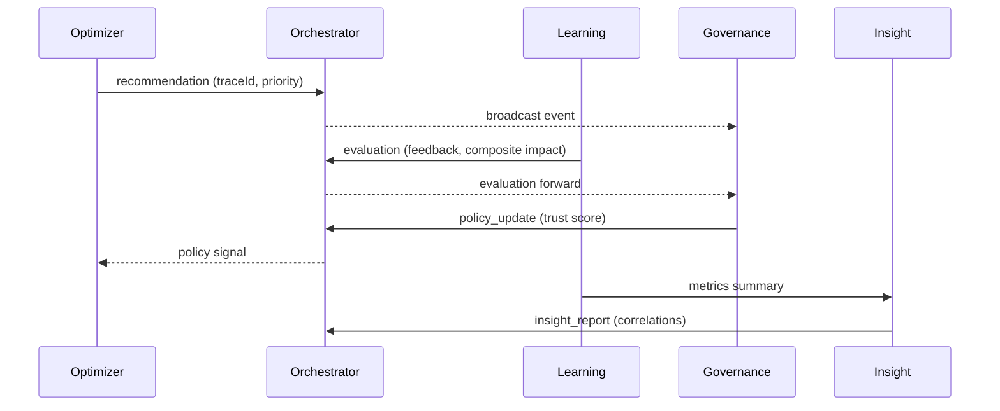

# InvoSmart AI Orchestration Layer

InvoSmart v1.4 menambahkan lapisan orkestrasi multi-agen agar Optimizer, Learning, Governance, dan Insight Agent dapat bertukar konteks secara deterministik. Orchestrator merekam setiap event ke Redis Stream (fallback in-memory) dan tabel `AgentEventLog` sehingga trace dapat diaudit kapan saja.

## Arsitektur



## Protokol MAP (Multi-Agent Protocol)

Setiap pesan divalidasi oleh schema Zod sebelum disimpan.

```json
{
  "traceId": "trace-019",
  "type": "evaluation",
  "source": "learning",
  "target": "governance",
  "priority": 60,
  "timestamp": "2025-10-26T03:15:12.412Z",
  "payload": {
    "summary": "Evaluasi /app/invoices +0.18",
    "recommendationId": "rec-9f3",
    "status": "approved",
    "compositeImpact": 0.18,
    "rollbackTriggered": false,
    "confidence": 0.84,
    "metrics": {
      "deltaLcp": 0.12,
      "deltaLatency": 0.05
    }
  }
}
```

## Dashboard Agent Graph

Halaman `/devtools/ai-agents` menampilkan:

- **Graf interaktif React Flow** yang memperlihatkan node tiap agent dan arus event antar node.
- **Log stream** terbaru dengan ringkasan payload dan metadata trace.
- **Panel konflik** yang merangkum trace dengan lebih dari satu event serta hasil `resolveConflict` berdasarkan prioritas governance > optimizer > learning > insight.

## Alur Audit

1. Optimizer menulis rekomendasi dan mengirim event `recommendation` (trace baru).
2. Learning mengevaluasi hasil, mengirim event `evaluation`, dan memicu Insight Agent membuat laporan korelasi.
3. Governance mengeluarkan `policy_update` dengan nilai trust score terbaru.
4. Orchestrator menyimpan seluruh event di Redis + `AgentEventLog` dan menyediakan snapshot debugging via `/api/ai/orchestrator`.

## Validasi

- `ENABLE_AI_ORCHESTRATION=true` memastikan orchestrator aktif.
- Test `orchestrator.test.ts` memverifikasi penyimpanan event, pengambilan evaluasi, dan prioritas konflik.
- Test `agent-collab.test.tsx` menjamin dashboard menampilkan graf, log, serta filter konflik.
